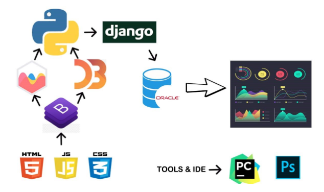
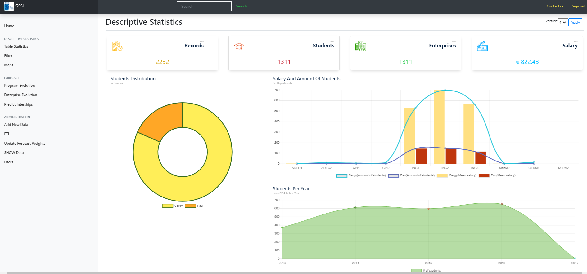
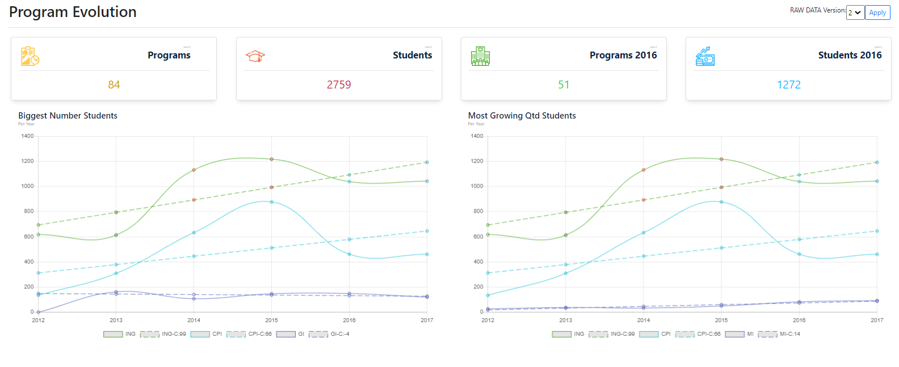

# ADEO_Project
## Introduction:
### This project is aimed at giving recommendation to students as well as enterprise-relation office in university. 
 * Application helps students to find the best company suiting their profile. This application recommendends ten companies to each student in which he/she has higher chance of getting selected. 
 * To the enterprise-relation office, application generated useful visualization that can help university analyze the recuiters, scale of renumeration offered, student enrolment by department, by country.
 
## Objectives of project:

  1. To help student apply for the companies where maximum likelihood of getting selected is more
  2. To help Administration analyse the trend in student enrolments, enterprise tie ups
  3. Create a geographical database of EISTI’s students with their personal address, campus address and the addresses where their internships took place. 
 #### Machine learning algorithm and our methodology  
  * Recommendation system using Adaptive Weighted Regression and Gradient Descent Algorithm
  * Random Forest for imputation
  * Trend and seasonal forecasting
  * Statistical study 
  * Visualization(D3 charts) for easy interpretation 
  
## Overview of Programming Tools

  
## Brief overview of project:
 > We construct a geographical database of EISTI’s students with their personal address, campus address and the addresses where their internships took place. 
 > Statistical study is performed regarding different departments, their student enrolment proportion, the internship and renumeration average, etc. Also we calculate the distance between: « home – campus », « home – internships location » and « campus – internships location » respectively. These statistics will serve to know the search trends and to generate a classification in order to help enterprise-relation office as well as students.
 > Machine learning algorithm is applied to generate recommendations

## Development Phase
#### Phase I: Data understanding and setting up the project space
  * Set up Django webserver
  * create DOM to store our database
  * Reading CSV and clean the data
  * Imputation using Random Forest to fill the missing values
#### Phase II: Statistical Study
  * Categorical and numerical analysis.
  * Univariate and Bivariate analysis
     o Student Demographic (Year, Campus, location )
     o Enterprise based analysis (Remuneration analysis,Location)
     o College (program , location)
  * Bivariate analysis
     o Correlation between Student ,Enterprise and College
  
#### Phase III: Data Modelling:
  * Data modeling
  * Clustering (location, campus, program)
  * Regression, forecasting, rules and Trend Analysis
  * geo mapping of location distance « home <–> campus », « home <–> internships location » and « campus <–> internships location »
  * Gradient boost for adaptive weights in regression

#### Phase IV:  Application development
  * User interface development
  * Database Integration
  * Applying Analysis with data and Integrating with interface.

### Phase V: Product Implementation and Testing
  * Deployment of test Webserver
  * Pytest of endpoints and function
  
## Images of Project

* Graphs depicting the Exploratory analysis dynamically applied according to the filter criteria

* Graphs depicting the trend and forecasting of different programs and enrolments

* Graphs depicting the forecast made about recruting companies and renumeration

* Navigation Bar with other options

![](Documents/s5.PNG
  
 

 
 
